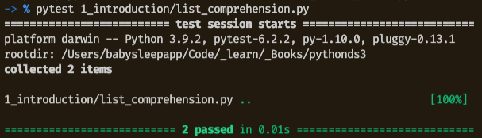

# Problem Solving with Algorithms and Data Structures using Python

By Brad Miller and David Ranum, Luther College.

Textbook provided for free by [Runestone Academy](https://runestone.academy/runestone/books/published/pythonds3/index.html). Consider [supporting them](https://runestone.academy/runestone/default/donate).

## Project Setup

### Jupyter Notebooks (*.ipynb files)

If you don't yet have an environment to run jupyter notebooks, you may choose to install `miniconda`. You can follow the instructions from [Vancouver DataJam](https://jenfly.github.io/datajam-python/SETUP) which will include installing the libraries needed for some of my solutions to the exercises (e.g. `pandas`, `matplotlib`).

After `conda` is installed, terminals will have the conda base environment activated by default. To stop this, run `conda config --set auto_activate_base false`.

#### Opening the jupyter notebooks

1. Activate the conda base environment, if not yet activated: `conda activate`
2. Run `jupyter notebook`
3. Navigate to the location of the notebook you want to open!
    - Searching the internet for `jupyter notebook basics` will give you lots of resources to get started on Jupyter notebooks.
4. When you're done, press `Control-C` to stop the notebook server
5. Deactivate conda: `conda deactivate`

### Tests

I use [pytest](https://docs.pytest.org/en/stable/contents.html) to run my tests. 

